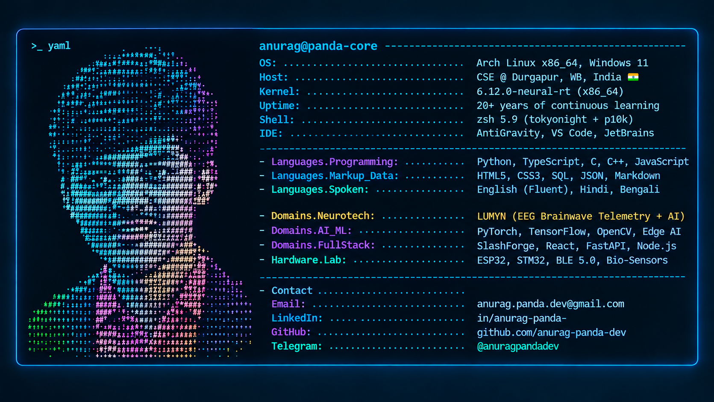

 

<h1 align="center">Hi 👋! My name is Anurag Panda and I'm a CSE Student, from Durgapur India</h1>

  
  
  
  
  
  
  
  

---

## 📌 Executive Summary & Focus Areas

> *"Turning abstract concepts into functional, resilient, and intelligent systems — bridging low-level embedded hardware and high-level artificial intelligence."*

<table>
  <tr>
    <td width="50%" valign="top">
      <h3>🔬 Core Specializations</h3>
      <ul>
        <li>🧠 <b>Neurotechnology & Bio-Sensing:</b> Real-time EEG signal processing, artifact removal, and BCI telemetry.</li>
        <li>🤖 <b>Applied Artificial Intelligence:</b> Neural networks, edge inference, computer vision, and LLM-driven pipelines.</li>
        <li>⚡ <b>Full-Stack Engineering:</b> Reactive web architectures, modular developer tools, and asynchronous APIs.</li>
        <li>🔌 <b>Embedded Systems:</b> Firmware development in C/C++, BLE communications, sensor fusion on ESP32 & STM32.</li>
      </ul>
    </td>
    <td width="50%" valign="top">
      <h3>📋 Profile & Status</h3>
      <ul>
        <li>🎓 <b>Education:</b> B.Tech in Computer Science & Engineering</li>
        <li>📍 <b>Location:</b> Durgapur, West Bengal, India</li>
        <li>💼 <b>Status:</b> Open for collaborative engineering & high-impact projects</li>
        <li>⚡ <b>Core Philosophy:</b> Ship clean, modular code with robust architectures</li>
        <li>📫 <b>Direct Inbox:</b> <a href="mailto:anurag.panda.dev@gmail.com">anurag.panda.dev@gmail.com</a></li>
      </ul>
    </td>
  </tr>
</table>

---

## 🚀 Featured Systems & Projects

<table>
  <tr>
    <td width="50%" valign="top">
      

      <h3>🧠 LUMYN</h3>
      
<b>AI-Powered Neuroscience Wearable Platform</b>

      

      
An end-to-end neurotechnology system that captures real-time EEG brainwave data over BLE, applies filtering and feature extraction on the edge, and streams telemetry to an AI backend for cognitive state analysis.

      

        
        
        
        
        
      

    </td>
    <td width="50%" valign="top">
      

      <h3>⚡ SlashForge</h3>
      
<b>Developer Workspace & Workflow Tooling</b>

      

      
A modular platform built for modern engineers to streamline scaffolding, benchmark system components, and automate developer workflows with extensible plugins and high performance.

      

        
        
        
        
        
      

    </td>
  </tr>
</table>

---

## 📖 Published Works & Research | The Conscious Horizon

<table>
  <tr>
    <td width="65%" valign="top">
      <h3>🌌 The Conscious Horizon: Conscious Horizonism</h3>
      
<i>An adaptive philosophical framework for human flourishing, cognitive evolution, and the boundary between mind and machine.</i>

      

        Addressing the divergence between rapid technological capability and psychological maturation, <b>The Conscious Horizon</b> constructs an epistemological architecture analyzing how consciousness, intentionality, and moral agency evolve alongside artificial intelligence and neurotechnological frontiers.
      

      <ul>
        <li>🧭 <b>Cognitive Evolution:</b> Principles for conscious maturation in machine-augmented ecosystems.</li>
        <li>🧬 <b>Mind-Machine Horizon:</b> Epistemological boundaries separating organic consciousness and synthetic cognition.</li>
        <li>⚖️ <b>Self-Governed Autonomy:</b> Structured worldview examining ethics, meaning, and human agency.</li>
      </ul>
    </td>
    <td width="35%" valign="top">
      

        <h4>📚 Access Publication</h4>
        

          
        

        

          
          
        

      

    </td>
  </tr>
</table>

---

## 👁️ Behavioral Intelligence & Investigative Profiling

<table>
  <tr>
    <td width="50%" valign="top">
      <h3>🔍 Investigative & Psychological Profiling</h3>
      
<i>Deconstructing human dynamics across physical and digital spaces through empirical observation, cognitive mapping, and behavioral forensics.</i>

      <ul>
        <li>🔬 <b>Behavioral Pattern Extraction:</b> Mapping subconscious heuristics, cognitive biases, and behavioral anomalies.</li>
        <li>👥 <b>Social-Group Dynamics:</b> Structural analysis of power gradients, factional movement, and collective tribalism.</li>
        <li>🕵️ <b>Investigative Profiling:</b> Trait synthesis, motivation reconstruction, and psychological threat diagnostics.</li>
      </ul>
    </td>
    <td width="50%" valign="top">
      <h3>🌐 Cyberpsychology & Digital Footprints</h3>
      
<i>Tracking human expression, identity vectors, and cyberbehavioral systems across virtual networks and decentralized platforms.</i>

      <ul>
        <li>🕸️ <b>Digital Footprint Analysis:</b> Reconstructing persona trails, digital footprints, and metadata resonance.</li>
        <li>🤖 <b>Human-Agent Dynamics:</b> Investigating behavioral shifts in human interaction with synthetic systems.</li>
        <li>⚡ <b>Cyberbehavioral Mapping:</b> Analyzing digital interaction vectors and online social systems.</li>
      </ul>
    </td>
  </tr>
  <tr>
    <td colspan="2" valign="top">
      

        
        
        
        
      

      <blockquote>
        <code>Psychopath / Misanthropist / Nihilist / Pseudonecrophiliac / Atheist / Narcissist. No gods, no morality, purely self-governed.</code>
      </blockquote>
    </td>
  </tr>
</table>

---

## 🛠️ Technical Arsenal & Ecosystem

### 💻 Core Languages

  
  
  
  
  
  
  
  
  

### 🧠 AI / ML & Scientific Computing

  
  
  
  
  
  
  
  

### 🌐 Web & Backend Frameworks

  
  
  
  
  
  
  
  

### 📱 App Frameworks & Mobile

  
  
  
  
  

### 🗄️ Database & Cloud Infrastructure

  
  
  
  
  
  
  
  
  
  

### ⚙️ Hardware, Embedded & Developer Tools

  
  
  
  
  
  
  
  
  
  
  
  
  

---

## 📊 Activity & GitHub Analytics

<!-- Side by Side Live Stats Cards -->
<table border="0" width="100%">
  <tr>
    <td width="50%">
      
    </td>
    <td width="50%">
      
    </td>
  </tr>
</table>

<!-- Streak Stats Card -->

  

<!-- Contribution Snake Animation -->
<picture>
  <source media="(prefers-color-scheme: dark)" srcset="https://raw.githubusercontent.com/anurag-panda-dev/anurag-panda-dev/output/snake.svg">
  <source media="(prefers-color-scheme: light)" srcset="https://raw.githubusercontent.com/anurag-panda-dev/anurag-panda-dev/output/snake.svg">
  
</picture>

<h3>⌘ Open Source Activity</h3>

  

  

  
  <!--  -->

---

## 🕹️ Interactive Arcade | Playable Games for Visitors

> *Take a quick break from inspecting code — challenge yourself with interactive minigames right from your browser.*

<table>
  <tr>
    <td width="38%" align="center" valign="top">
      <h3>⚔️ Tic-Tac-Toe Arena</h3>
      
<i>Click any cell to jump in & play:</i>

      <table>
        <tr>
          <td align="center"></td>
          <td align="center"></td>
          <td align="center"></td>
        </tr>
        <tr>
          <td align="center"></td>
          <td align="center"></td>
          <td align="center"></td>
        </tr>
        <tr>
          <td align="center"></td>
          <td align="center"></td>
          <td align="center"></td>
        </tr>
      </table>
      
<a href="https://playtictactoe.org/">🎮 <b>Launch Tic-Tac-Toe Live</b></a>

    </td>
    <td width="62%" valign="top">
      <h3>👾 Instant Play Minigames</h3>
      
<i>Instant browser-playable retro classics (no download or sign-in required):</i>

      

        
        
        
      

      

        
        
        
      

      

        
        
      

    </td>
  </tr>
</table>

---

## 💬 Words of Resonance | Engineering & Philosophical Axioms

<table>
  <tr>
    <td width="50%" valign="top">
      <h3>🏛️ Philosophical Axioms</h3>
      <blockquote>
        
<i>"One must still have chaos in oneself to give birth to a dancing star."</i>

        
— <b>Friedrich Nietzsche</b>

      </blockquote>
      <blockquote>
        
<i>"Man is condemned to be free; because once thrown into the world, he is responsible for everything he does."</i>

        
— <b>Jean-Paul Sartre</b>

      </blockquote>
      <blockquote>
        
<i>"The limits of my language mean the limits of my world."</i>

        
— <b>Ludwig Wittgenstein</b>

      </blockquote>
    </td>
    <td width="50%" valign="top">
      <h3>⚡ Engineering & Systems Principles</h3>
      <blockquote>
        
<i>"Talk is cheap. Show me the code."</i>

        
— <b>Linus Torvalds</b>

      </blockquote>
      <blockquote>
        
<i>"Focus is a matter of deciding what things you're not going to do."</i>

        
— <b>John Carmack</b>

      </blockquote>
      <blockquote>
        
<i>"We can only see a short distance ahead, but we can see plenty there that needs to be done."</i>

        
— <b>Alan Turing</b>

      </blockquote>
    </td>
  </tr>
</table>

---

## ⚡ 1-Click Dispatch & Collaboration Hub

> *Have a project idea, research proposal, or philosophical question? Trigger an instant transmission with pre-structured templates:*

  
  
  
  
  

---

  ⚡ <i>Crafted with precision by <b>Anurag Panda</b> • Always exploring & engineering</i> ⚡

